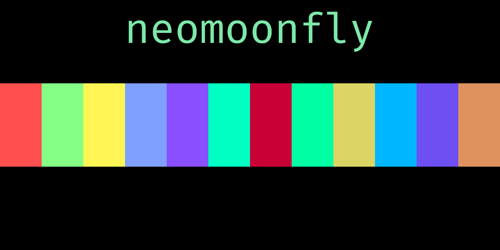

# _neomoonfly_



_neomoonfly_ is a fork of the [_moonfly_](https://github.com/bluz71/vim-moonfly-colors)
theme created by bluz71. I take absolutely no credit for the vast majority of
the theme: there are a couple of minor modifications made to accommodate for
some of my personal preferences, but other than that, it's pretty much exactly
the same.

Sources of inspiration for the original _moonfly_ theme include:

- [Monokai](https://monokai.pro)
- [One Dark](https://github.com/atom/atom/tree/master/packages/one-dark-syntax)

Sources of inspiration for _neomoonfly_ include:

- [Koehler](https://github.com/rodnaph/vim-color-schemes/blob/master/colors/koehler.vim)
- [moonfly](https://github.com/bluz71/vim-moonfly-colors) (of course)

Although not even tangentially related to _neomoonfly_ or _moonfly_, bluz71,
the creator of _moonfly_, maintains another theme named _nightfly_, which is
available [here](https://github.com/bluz71/vim-nightfly-guicolors).

I fully intend on keeping _neomoonfly_ completely up-to-date with the
original _moonfly_ color scheme, but this is a fork of the project: there
will invariably be some divergences.

## Screenshots
Check out some screenshots [here](./screenshots/readme.md).

## Quickstart
Here's an example of getting _neomoonfly_ set up. This configures all of the
default options (you could omit all of the `let` statements and be completely
fine) and sets the color scheme to _neomoonfly_.
```vim
let g:nmfCursorColor = 0
let g:nmfItalics = 1
let g:nmfNormalFloat = 0
let g:nmfTerminalColors = 1
let g:nmfTransparent = 0
let g:nmfUndercurls = 1
let g:nmfUnderlineMatchParen = 0
let g:nmfVertSplits = 1

let g:nmfCursorLine = 1
let g:nmfCursorColumn = 1

let g:nmfCursorLineColor = '#312a5e'
let g:nmfCursorColumnColor = '#312a5e'

let g:nmfCursorLineColorInsert = '#23007a'
let g:nmfCursorColumnColorInsert = '#23007a'

let g:nmfNormalBg = '#000000'
let g:nmfNormalFg = '#7de8aa'

let g:nmfLineNrBg = '#000000'
let g:nmfLineNrFg = '#00ffd9'

" if you use airline and want to use neomoonfly for airline:
let g:airline_theme = 'neomoonfly'

" set the color scheme to moonfly
color neomoonfly

" optionally, you could do:
" color neomoonflyext
```

## Additional Configuration
_neomoonfly_ adds a couple of "features," if you'll call them that, to the
original _moonfly_. Those are as follows:
- `g:nmfCursorLine`: 0 to disable cursor line, 1 to enable cursor line
  (1 by default)
- `g:nmfCursorColumn`: 0 to disable cursor column, 1 to enable cursor column
  (1 by default)
- `g:nmfCursorLineColor`: a hex color (ex. `#00ff00`), highlights the
  cursor's row/line when not in insert mode
- `g:nmfCursorColumnColor`: a hex color (ex. `#00ff00`), highlights the
  cursor's column when not in insert mode
- `g:nmfCursorLineColorInsert`: a hex color (ex. `#00ff00`),
  highlights the cursor's row/line when not in insert mode
- `g:nmfCursorColumnColorInsert`: a hex color (ex. `#00ff00`),
  highlights the cursor's column when not in insert mode
- `g:nmfNormalBg`: a hex color, default text background
- `g:nmfNormalFg`: a hex color, default text foreground
- `g:nmfLineNrBg`: a hex color, default line number background
- `g:nmfLineNrFg`: a hex color, defualt line number foreground

## _neomoonflyext_ color scheme
Click [here](./neomoonflyext.md) to learn more!

## License
[](https://opensource.org/licenses/MIT)
