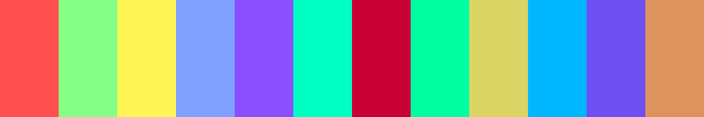
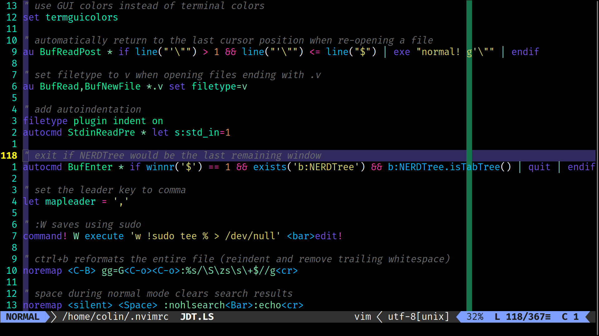

# _neomoonfly_

_neomoonfly_ is a fork of the [_moonfly_](https://github.com/bluz71/vim-moonfly-colors)
theme created by bluz71. I take absolutely no credit for the vast majority of
the theme: there are a couple of minor modifications made to accommodate for
some of my personal preferences, but other than that, it's pretty much exactly
the same.

Sources of inspiration for the original _moonfly_ theme include:

- [Monokai](https://monokai.pro)
- [One Dark](https://github.com/atom/atom/tree/master/packages/one-dark-syntax)

Although not even tangentially related to _neomoonfly_ or _moonfly_, bluz71,
the creator of _moonfly_, maintains another theme named _nightfly_, which is
available [here](https://github.com/bluz71/vim-nightfly-guicolors).

## Screenshots
Check out some screenshots [here](./screenshots/readme.md).

## Additional Configuration
_neomoonfly_ adds a couple of "features," if you'll call them that, to the
original _moonfly_. Those are as follows:
- `g:nmfCursorLine`: 0 to disable cursor line, 1 to enable cursor line
- `g:nmfCursorColumn`: 0 to disable cursor column, 1 to enable cursor column
- `g:nmfCursorLineColor`: a hex color (ex. `#00ff00`), highlights the
  cursor's row/line when not in insert mode
- `g:nmfCursorColumnColor`: a hex color (ex. `#00ff00`), highlights the
  cursor's column when not in insert mode
- `g:nmfCursorLineColorInsert`: a hex color (ex. `#00ff00`),
  highlights the cursor's row/line when not in insert mode
- `g:nmfCursorColumnColorInsert`: a hex color (ex. `#00ff00`),
  highlights the cursor's column when not in insert mode
- `g:nmfNormalBg`: a hex color, default text background
- `g:nmfNormalFg`: a hex color, default text foreground
- `g:nmfLineNrBg`: a hex color, default line number background
- `g:nmfLineNrFg`: a hex color, defualt line number foreground

## _nmfext_ color scheme
Click [here](./nmfext.md) to learn more!

## License

